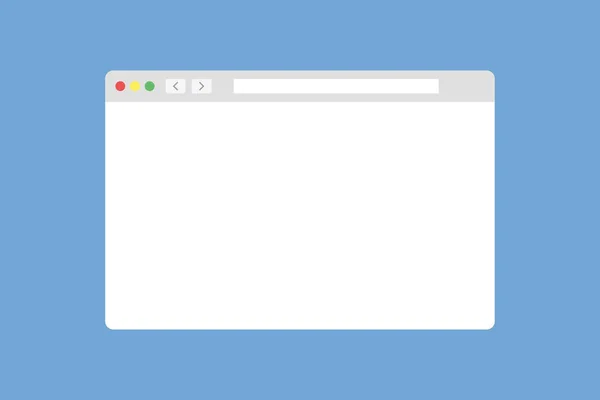

# [Nombre de tu Proyecto] ✨

---

## 📷 Capturas del Proyecto




### Descripción del Proyecto

¡Bienvenido/a al repositorio de **[Nombre de tu Proyecto]**!

Este proyecto tiene como objetivo [Describe en 1-2 frases muy claras qué hace tu proyecto o qué problema resuelve]. Fue creado para [Menciona brevemente la razón o el propósito, e.g., explorar una nueva tecnología, practicar una habilidad específica, ser parte de un portafolio].

---

### 🚀 ¿Cómo empezar? (¡Manos a la obra!)

Para poner este proyecto en marcha en tu máquina local, sigue estos sencillos pasos:

1.  **Clona el repositorio:**
    ```bash
    git clone 
    ```
2.  **Navega al directorio del proyecto:**
    ```bash
    cd [nombre-de-tu-proyecto]
    ```
3.  **[Opcional] Instala las dependencias:**
    * Si tu proyecto usa paquetes (ej. Node.js, Python), aquí irían las instrucciones para instalarlos.
    * Ejemplo para Node.js: `npm install` o `yarn install`
    * Ejemplo para Python: `pip install -r requirements.txt`
4.  **[Opcional] Inicia el proyecto:**
    * Si es una aplicación web, un servidor local, etc., aquí irían las instrucciones para ejecutarla.
    * Ejemplo: `npm start` o `python app.py`

---

### 🛠️ Tecnologías Utilizadas

Este proyecto fue construido usando:

---

### 🌟 Estado del Proyecto

Actualmente, el proyecto está en **[Estado actual: e.g., en desarrollo, completado, mantenimiento, fase beta]**.

[Opcional: Si está en desarrollo, puedes añadir qué sigue o qué quieres mejorar.]


---

### 📞 Contacto

Si tienes alguna pregunta o sugerencia sobre este proyecto, no dudes en contactarme:

* **Correo Electrónico:**
* **GitHub:**

---

¡Gracias por visitar este proyecto! Espero que te sea útil.
